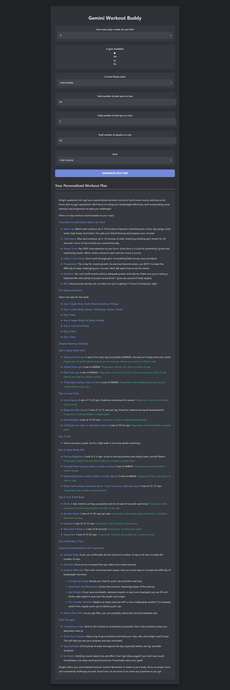

# 💪 Gemini Workout Buddy

Gemini Workout Buddy is a smart, AI-powered fitness web app that generates **personalized workout routines** based on your current fitness level, goals, equipment access, and availability. It uses **Google Gemini** to create tailored plans — whether you're training at home or in the gym.

## 🧠 Built With

- **React** – Frontend UI
- **Google Gemini API** – Generates AI-based personalized workout plans

---

## 🖼️ Preview



---

## 🚀 Features

- 🔢 Select how many days per week you're available
- 🏋️ Choose between gym or no-gym workouts
- 🧍 Specify fitness level (Beginner, Intermediate, Advanced)
- 🔢 Enter max reps of push-ups, pull-ups, and squats
- 🎯 Set your goal (e.g. gain muscle, lose fat)
- 🤖 Instantly get a detailed, AI-generated workout plan
- 📝 Routine includes rest days, warmups, cooldowns, progression tips, and more!

---

## 📦 Getting Started

### 1. Clone the repository

```bash
git clone https://github.com/Rujit69/Workout-AI-Agent.git
cd gemini-workout-buddy
```

### 2. Install dependencies

```bash
npm install
```

### 3. Add your Gemini API key

Create a .env file in the root directory and add:

```bash
VITE_GEMINI_API_KEY=your_api_key_here
```

## 4. Start the development server

```bash
npm start
```
